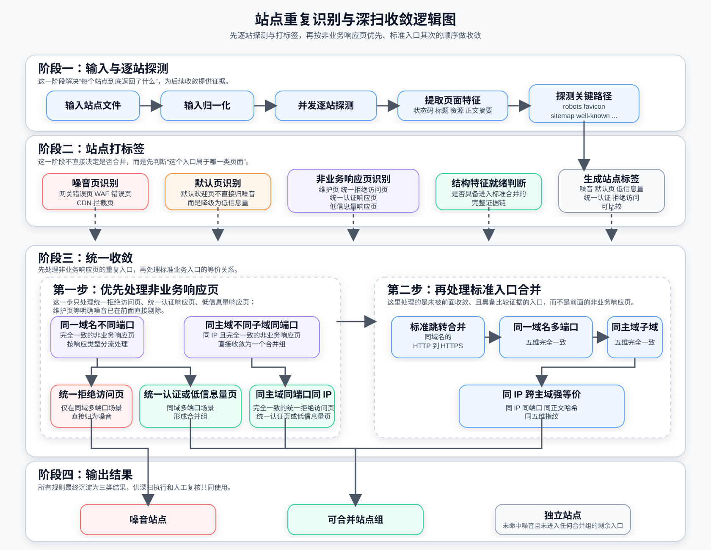

# Site Dedup Classifier

站点重复识别与深扫收敛工具 - 在安全扫描前自动识别并收敛重复站点，提升扫描效率。

## 背景

在常规互联网测绘和深扫链路里，**同一套业务往往会以多个入口同时出现**，例如：

- 同一 `hostname` 开了多个 Web 端口
- 同一主域名下有多个子域，但实际上都返回同一套非业务响应页
- 不同主域名指向同一 IP，且实际是同一套业务站点
- 某些入口虽然"有响应"，但返回的只是维护页、统一拒绝访问页、网关错误页、默认欢迎页

如果不做识别，这些入口会被当成独立站点全部进入后续深扫，带来几个问题：

- 重复扫描，浪费任务配额、时间和资源
- 噪音页面进入深扫，污染结果
- 人工复核成本高，很难快速判断哪些是真实业务入口

这个脚本的目标就是在**进入深扫之前**，先对一批站点做一次统一判定，把它们分成三类：

- **噪音站点**：明确没有继续深扫价值
- **可合并站点组**：入口事实保留，但执行层只保留一个代表入口继续深扫
- **独立站点**：保守保留，继续作为独立入口处理

核心原则：**资产事实尽量保留，深扫执行做收敛；只有证据足够强时才自动合并。**

## 目录内容

- `site_dedup_classifier.py`：主脚本
- `site_dedup_rules.yaml`：外部规则文件，维护噪音规则、默认页规则、维护页规则、非业务响应页关键字等
- `test/`：本地测试样例与回归案例清单

说明：

- `PyYAML` 可用时优先用 `yaml.safe_load` 加载规则
- 如果本机没装 `PyYAML`，脚本会使用内置的精简 YAML 解析逻辑加载当前规则格式
- 输出默认优先使用 `Rich` 展示；如果本机没装 `rich`，会自动回退为纯文本输出

## 快速使用

```bash
python3 site_dedup_classifier.py -f sites.txt -o results.json --workers 50
```

常用参数：

- `-f, --file`：输入文件，一行一个站点
- `-o, --output`：输出完整 JSON 结果
- `--rules`：指定规则文件，默认读取同目录下的 `site_dedup_rules.yaml`
- `--workers`：并发数
- `--timeout`：单请求超时时间
- `--retries`：失败重试次数
- `--verify-tls`：开启 HTTPS 证书校验
- `--no-progress`：关闭进度展示
- `--details`：直接把完整 JSON 打到标准输出

当前实现里：

- 默认 `verify_tls = false`
- 默认使用浏览器风格 `User-Agent`
- 默认支持失败重试
- 默认展示任务进度、并发数、任务耗时、结果概要

## 整体实现思路

这部分以当前代码为准，主干逻辑集中在：

- `analyze_site`
- `collect_same_host_shell_results`
- `collect_same_port_subdomain_shell_results`
- `collect_redirect_merges`
- `collect_equivalent_merges`
- `build_output`

### 整体架构图

整体是一条"先识别、再收敛、最后分流"的处理链路：

1. 系统先对输入站点逐个探测，提取状态码、标题、正文和关键资源等特征；
2. 再给每个入口打上噪音页、默认页、非业务响应页或可比较入口等标签；
3. 其中命中强噪音规则的站点，会直接剔除，不再进入后续收敛流程；
4. 随后系统优先处理重复的非业务响应页；这类页面不会仅凭"像统一响应"就直接判噪音，而是按具体场景决定是剔除还是合并保留代表入口；
5. 最后再对剩余具备比较价值的标准入口，按跳转关系、同域多端口、同主域子域以及同 IP 强等价等规则继续收敛；
6. 最终输出为**噪音站点**、**可合并站点组**和**独立站点**三类结果。



### 处理流程分解

#### 第一步：输入归一化

脚本先把输入的一批站点规范化成统一 URL：

- 自动补齐协议
- 根据端口提示推断 `http` / `https`
- 统一 URL 形式
- 去重
- 识别是否为 IP 直连
- 计算主域（`registrable_domain`）

这部分对应 `parse_site_line`、`normalize_site_url`、`get_registrable_domain`。

#### 第二步：单站点探测与特征提取

每个站点会执行 `analyze_site`，拿到一组后续判定所需的证据：

- 解析 IP：`resolved_ips`
- 首页原始响应与最终响应：`original_status`、`final_status`、`final_url`
- 页面基础信息：`title`、`meta_description`、`meta_keywords`、`meta_generator`、`meta_viewport`
- 响应头摘要：`ETag`、`Last-Modified`、`Server`、`X-Powered-By`、`Content-Type`
- 页面资源：`script src`、`stylesheet`、`icon`
- 正文摘要与正文哈希：`body_text_excerpt`、`body_sha256`
- 关键路径探测结果：`/robots.txt`、`/favicon.ico`、`/sitemap.xml`、`/.well-known/`

如果安装了 `requests`，优先使用 `requests` 发请求；否则自动回退到 `urllib`。

#### 第三步：基础分类

基础分类不是直接"看起来像就处理"，而是先把站点归入几个基础语义标签。

##### 3.1 噪音识别 `detect_noise`

当前代码会先识别几类明显噪音：

- 小体积网关错误页（如 `502/503/504` 且正文很小）
- 标题命中错误页 / WAF 标题特征
- 正文命中错误页 / WAF 正文特征
- CDN / WAF 拦截页

注意：**默认欢迎页不在这里直接打成噪音。**

##### 3.2 默认页识别 `detect_default_page`

像下面这些页面会命中"默认欢迎页"：

- `Welcome to nginx!`
- Tomcat 默认页
- Apache 测试页

当前实现里，默认欢迎页的处理口径是：

- 标记为 `default_page_hit = true`
- 同时强制视为 `low_information = true`
- **不直接归入噪音**
- 默认作为"低信息量独立站点"保留
- 只有在后续已放开的非业务响应页收敛场景里，才允许被合并

##### 3.3 非业务响应页识别 `classify_response_shell`

代码里当前识别 4 类非业务响应页：

- `maintenance_shell`：明确维护页
- `deny_shell`：统一拒绝访问响应页
- `auth_api_shell`：统一认证 / API 未登录响应页
- `low_information_shell`：低信息量响应页

具体口径：

- 维护页：标题或正文命中维护关键字，直接识别
- 统一认证响应页：`Content-Type` 命中认证类配置，且正文命中认证关键字
- 统一拒绝访问响应页：状态码通常为 `401/403`，或属于低信息量 XML/JSON 非业务响应，且正文命中 `access denied` / `forbidden` 等规则
- 低信息量响应页：正文短、资源极少或没有非图标资源

这里要特别注意一个边界：

- `maintenance_shell` 会直接进入噪音结果
- `deny_shell` / `auth_api_shell` / `low_information_shell` 只是"非业务响应页标签"，**不是天然等于噪音**
- 这三类后续到底是"归为噪音"还是"形成合并组"，要看进入的是哪一种收敛场景

##### 3.4 五维特征就绪判断 `comparison_ready`

对于正常业务页，脚本不会只凭首页正文去合并，而是要求五类特征都准备好：

1. `header_signature`
2. `redirect_signature`
3. `structure_signature`
4. `resource_signature`
5. `key_path_signature`

其中 `structure_signature` 当前会综合以下页面结构字段，按"有哪个取哪个"的方式参与判定：

- `title`
- `meta_description`
- `meta_keywords`
- `meta_generator`
- `meta_viewport`

只有这五维都不为空，才会进入标准等价合并；否则保持保守。

### URL 合并与收敛逻辑

#### 场景 A：同 `hostname` 不同端口的非业务响应页处理

对应 `collect_same_host_shell_results`。

触发条件：

- 同一个 `hostname`
- 端口不同
- 非业务响应页类型属于 `deny_shell` / `auth_api_shell` / `low_information_shell`
- `shell_merge_fingerprint` 完全一致

处理结果：

- `deny_shell`：直接归为噪音，原因是 `同hostname多端口统一拒绝访问响应页`（含 IP 字面量 hostname）
- `auth_api_shell` / `low_information_shell`：归为一个可合并组，只保留一个代表入口；**IP 字面量作为 hostname 时同样适用**

这里之所以可以对 `deny_shell` 更激进，是因为"同一 hostname 的多个端口"通常更像同一入口的重复暴露；如果这些端口只是重复返回同一套统一拒绝访问响应页，继续分别深扫的价值较低。

#### 场景 B：同主域、不同子域、相同端口的非业务响应页处理

对应 `collect_same_port_subdomain_shell_results`。

触发条件：

- `registrable_domain` 相同
- `hostname` 不同
- 端口相同
- 解析 IP 一致
- 非业务响应页类型属于 `deny_shell` / `auth_api_shell` / `low_information_shell`
- `shell_merge_fingerprint` 完全一致

处理结果：

- 归为一个"同端口子域非业务响应页收敛"组
- 这里**不会直接打成噪音**，而是保留一个代表入口继续扫

原因是：在这个场景里，"响应一致"只能说明这些子域当前被同一层统一响应页拦在前面，不能充分说明后面的业务一定没有价值。也就是说，这里做的是"去重收敛"，不是"直接判死"。

#### 场景 C：标准 `HTTP -> HTTPS` 跳转合并

对应 `collect_redirect_merges`。

只有满足下面条件才合并：

- 源入口是 `http`
- 原始响应是 `3xx`
- 跳转目标是 `https`
- 跳转前后 `hostname` 相同

这类场景归类为 `标准HTTP跳转HTTPS`。

#### 场景 D：同 `hostname` 多端口的标准五维等价合并

对应 `collect_equivalent_merges` 的第一段逻辑。

条件：

- 不是噪音
- 不是非业务响应页
- 不是低信息量页
- 不是统一认证响应页倾向
- `comparison_ready = true`
- 五维指纹 `equivalence_fingerprint` 完全一致

满足后，会归为 `同hostname多端口等价`。

#### 场景 E：同主域不同子域的标准五维等价合并

对应 `collect_equivalent_merges` 的第二段逻辑。

条件：

- `registrable_domain` 相同
- 至少两个不同 `hostname`
- 不是 IP 直连
- 不是噪音
- 不是非业务响应页
- 不是低信息量页
- 不是统一认证响应页倾向
- `comparison_ready = true`
- 五维指纹完全一致

满足后，会归为 `同主域子域等价`。

#### 场景 F：同 IP 跨主域强等价合并

对应 `collect_equivalent_merges` 的第三段逻辑。

这是当前代码里最严格的一类跨主域放开策略，要求同时满足：

- 不是 IP 直连
- 不是噪音
- 不是非业务响应页
- 不是低信息量页
- 不是统一认证响应页倾向
- 有解析 IP，且解析 IP 完全一致
- 端口相同
- 最终状态码相同
- 首页正文哈希 `body_sha256` 相同
- 五维指纹 `equivalence_fingerprint` 相同
- 至少涉及两个不同主域名

只有全部满足，才归为 `同IP跨主域强等价`。

### 结构化 XML/JSON 非业务响应页为什么能合并

对应 `build_shell_merge_fingerprint`、`build_structured_payload_signature`。

对于 `deny_shell` 和 `auth_api_shell`，代码不是直接拿原始正文哈希比，而是会先尝试做结构化语义归一：

- JSON：递归提取稳定语义字段
- XML：递归提取稳定节点字段
- 只保留白名单语义字段，例如：`code`、`message`、`error`、`status`、`detail`、`data` 等
- 动态字段如果不在语义字段白名单里，就不会进入归一后的指纹

这样做的作用是：

- 同一类 XML/JSON 拒绝访问响应页，即使带有请求级动态内容，也更容易识别为同一非业务响应页
- 又不会把"只有格式像、语义不一样"的响应误合并

### 代表入口如何选

对应 `choose_representative`。

当前优先级是：

1. 优先非跳转入口
2. 优先 `https`
3. 优先 `443` 端口
4. 优先非 IP 直连入口
5. 最后按 URL 字典序兜底

也就是说，合并后尽量保留一个"更像真实业务入口、也更稳定"的地址继续深扫。

## 与代码对应的判定边界

下面这些边界是当前代码明确保守保留的，不是"忘了处理"，而是有意控制误判：

- **强噪音规则**：只有命中 `detect_noise` 明确规则的页面，或 `maintenance_shell` 这类明确无业务价值的页面，才会直接剔除
- **统一拒绝访问响应页不是天然噪音**：`deny_shell` 在同 `hostname` 多端口场景下会打成噪音，但在同主域不同子域同端口场景下只做收敛合并
- **IP 直连入口**：默认不参与基于主域名或跨主域的自动收敛；同一 IP 字面量下的多端口入口，若命中同 hostname 壳页且指纹一致，按场景 A 处理（`deny_shell` 打噪音，`auth_api_shell` / `low_information_shell` 收敛）；若五维特征完全一致，也可按场景 D 合并
- **不同子域名 + 不同端口**：即使都返回 `403` / 默认页 / 低信息量页，也不自动处理
- **跨主域非业务响应页**：当前不做自动非业务响应页收敛
- **五维特征不足**：只要 `comparison_ready = false`，标准业务页就不进入五维等价合并
- **仅标题相同**：不会合并
- **仅解析到同一 IP**：不会合并，除非同时满足"同 IP 跨主域强等价"的所有严格条件

## 典型案例

### 案例 1：同 hostname 多端口统一拒绝访问响应页

**场景**：同一 hostname 的多个端口返回完全一致的 403 Access Denied 页面

**结果**：噪音

**原因**：同 `hostname`、不同端口，且命中完全一致的 `deny_shell`，在 `collect_same_host_shell_results` 中打成噪音

### 案例 2：同主域不同子域统一认证响应页

**场景**：同主域下多个子域在相同端口返回完全一致的统一认证响应页，且解析 IP 一致

**结果**：可合并

**原因**：同主域、不同子域、相同端口、相同 IP、相同统一认证响应页，命中"同端口子域非业务响应页收敛"

### 案例 3：多环境站点识别

**场景**：同一业务的生产、测试、开发三套环境，分布在不同主域名下

**结果**：生产组与测试组分别满足 `同IP跨主域强等价` 合并，开发组因关键证据不同被单独保留

**原因**：不会因为"业务名相同"就把所有入口直接合成 1 个站点，也不会因为"不同主域名"就一律全部保留。只有同时满足"同 IP + 同端口 + 同正文哈希 + 五维指纹一致"的入口，才会在环境内收敛成组

### 案例 4：默认欢迎页处理

**场景**：nginx 默认欢迎页

**结果**：独立站点（低信息量）

**原因**：命中 nginx 默认欢迎页，但当前口径是不直接打噪音，而是降级为低信息量独立站点

### 案例 5：五维特征不足的保守保留

**场景**：同一 hostname 的两个端口，一个是正常登录页但五维特征不足，一个是低信息量页面

**结果**：独立站点

**原因**：当前代码不会仅凭"同 hostname"就合并，需要五维特征全部一致

### 案例 6：标题相同但内容不同

**场景**：同一 hostname 的两个端口，标题相同但正文哈希、资源、关键路径探测结果不同

**结果**：独立站点

**原因**：虽然标题相同，但正文哈希、资源、关键路径探测结果不同，不满足同站点等价条件

## 输出结果说明

脚本输出分两层：

### 终端概要输出

终端会展示：

- 输入站点数
- 使用并发数
- 任务耗时
- 探测失败数
- 噪音站点数
- 可合并站点组数
- 可合并站点成员数
- 独立站点数
- 失败原因概要
- 噪音站点示例
- 可合并站点组概要
- 独立站点示例

如果安装了 `rich`，默认走 Rich 表格展示；否则自动回退为纯文本。

### JSON 明细输出

如果指定 `-o`，会写出完整 JSON，包含：

- `summary`
- `failure_summary`
- `noise_sites`
- `merge_groups`
- `independent_sites`
- `details`

其中 `details` 里会保留每个站点的探测细节，便于人工复核，例如：

- 状态码
- 最终 URL
- `title`
- `server`
- `content_type`
- `body_sha256`
- `noise_reasons`
- `default_page_hit`
- `low_information`
- `auth_shell_like`
- `shell_type`
- `resolved_ips`
- `comparison_ready`
- `key_paths`

## 规则维护建议

当前很多可变规则都已经外置到了 `site_dedup_rules.yaml`，后续建议优先在规则层维护，而不是直接改脚本逻辑：

- 错误页 / WAF 标题规则
- 错误页 / WAF 正文规则
- 默认欢迎页规则
- 维护页规则
- 拒绝访问关键字
- 统一认证响应页关键字
- 域名后缀规则
- 网络层参数（UA、重试、TLS 校验、代理）

这样做的好处是：

- 便于持续加样本
- 便于灰度调参
- 不需要每次都改代码发版

## 依赖

推荐安装的运行依赖：

- `requests`：更稳定的 HTTP 请求实现；未安装时脚本会回退到 `urllib`
- `PyYAML`：加载规则文件；未安装时脚本会回退到内置精简 YAML 解析器
- `rich`：更友好的终端结果展示；未安装时脚本会回退到纯文本输出

安装依赖：

```bash
pip install -r requirements.txt
```

## 许可证

MIT License